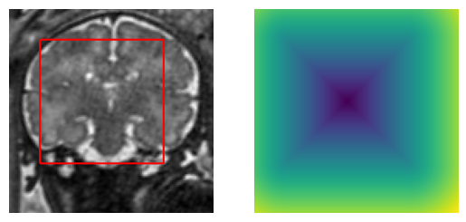
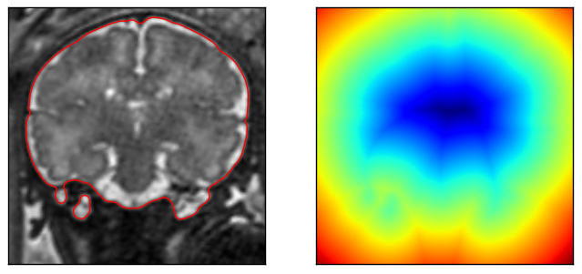

Chan-Vese level-sets in Python
=============================

Numpy adaptation of the Chan-Vese level-sets code from creaseg
(http://www.creatis.insa-lyon.fr/~bernard/creaseg/). The relevant file from the
original source code is in the creaseg/ folder.  
The code from Burak Bayramli
(http://ascratchpad.blogspot.com/2011/03/image-segmentation-using-active.html)
has been useful when performing this adaptation.

The Chan-Vese level sets model aims at minimizing the energy:

where I is the image, C is the boundary of the segmented region, c_1 and c_2 are
the averages of I respectively inside and outside C, and kappa is the curvature
of C.

Example
-------

Reference
---------

T. Chan and L. Vese. "Active contours without edges".
IEEE Transactions on Image Processing. Volume 10, pp. 266-277, February 2001.
